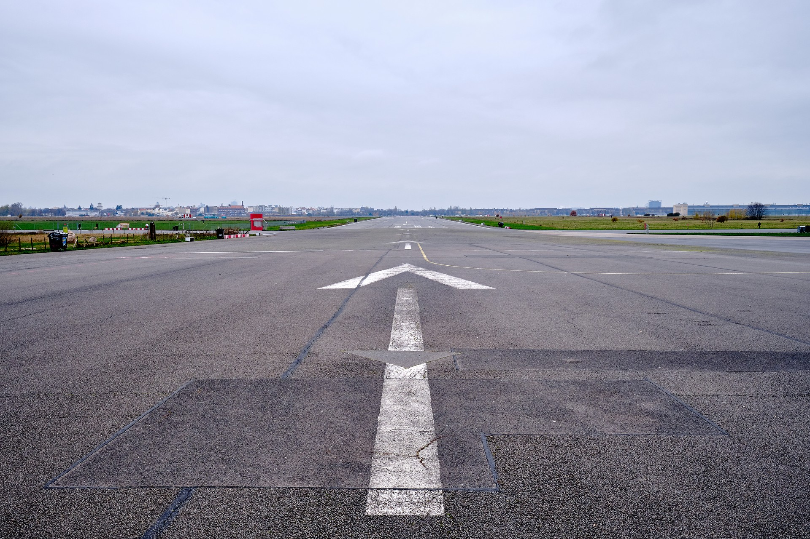

Another year (2023) comes to an end, and it is time to reflect on the past and think about the future. Since I didn't write anything on my blog in 2023, what better occasion to share my thoughts here?

I am not willing to reflect on the year that has ended. It has not been a great year, and I got my learnings already. I would rather focus on what's next.

I tried in the past the approach of 

> "OK, this is what happened last year, and this is what I would like to commit to the next one".

It didn't go very well. The reason is that I committed to too many unrelated things. There was no focus and not an underlying context. **No mission.**

I am curious and love to do lots of stuff, but I don't have that much free time to do everything I would like to do. The consequence is that I tend to jump from one thing to another without taking them to an end. Not good. It is inefficient, and I like an efficient process. I am an engineer, after all.

I always got the feeling that something was missing. There was a missing piece in the puzzle. Then I figured it out: I had no focus. 

I spent a lot of effort in many different directions. There was a general idea of where I was going, but my progression was slow and confused. If I have to use a metaphor, I walk in circles instead of going straight in a direction.

Once I realised that, the next step was to find the common point. What do all my activities have in common that makes me feel fulfilled? What is the red string linking what I spent time and effort on? The answer is _knowledge_.

For many years, I have dedicated my free time to expanding my knowledge and sharing it with others. I love to share knowledge with the world _for free_. The projects I built, the articles I wrote, the podcast, and mentoring: all is about building and sharing knowledge.

Finally, I nailed it, and I understood what's the direction. What's my mission. I want to help people:

**Build knowledge.**  
**Share knowledge.**  
**Make knowledge accessible.**

From now on, I'll put my effort into anything around it. If something doesn't inspire me to move in that direction, it's not worth pursuing.

This way, it is not hard to choose what I would like to commit to for the next year:

- **I will attend a course to improve my writing**. Being able to express any concept or idea in written words is fundamental to share knowldege. It is a skill that makes a difference also in the workplace.

- **I will attend a course to improve my public speaking**. I didn't get to do it much, but I would like to be a good speaker. It has the same importance as improve my writing.

- **I'll build and share again**. It has been a long time, but I would like to get back to building something interesting and sharing my learnings. I am thinking of building something to help people share knowledge, but it is still foggy.

That's all. I hope this was interesting enough and gave you some ideas to reflect on: **what is your mission?**

---

*photo by me.*